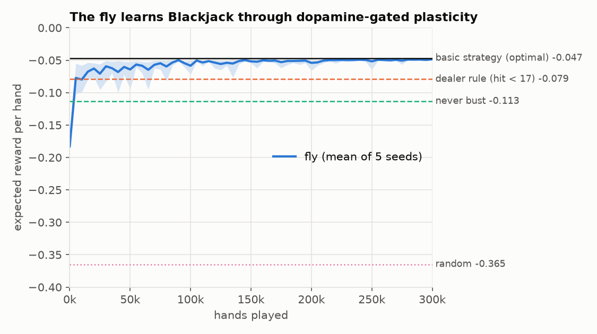
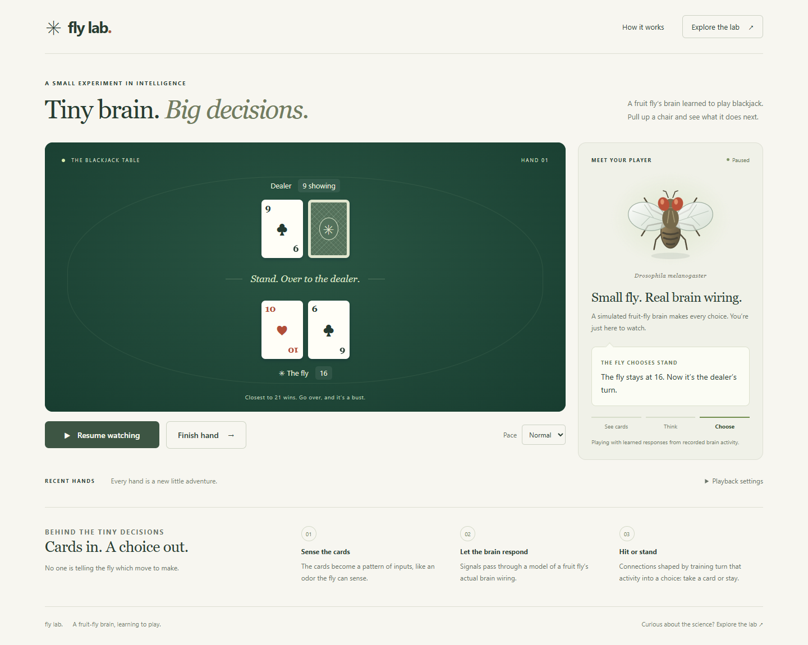
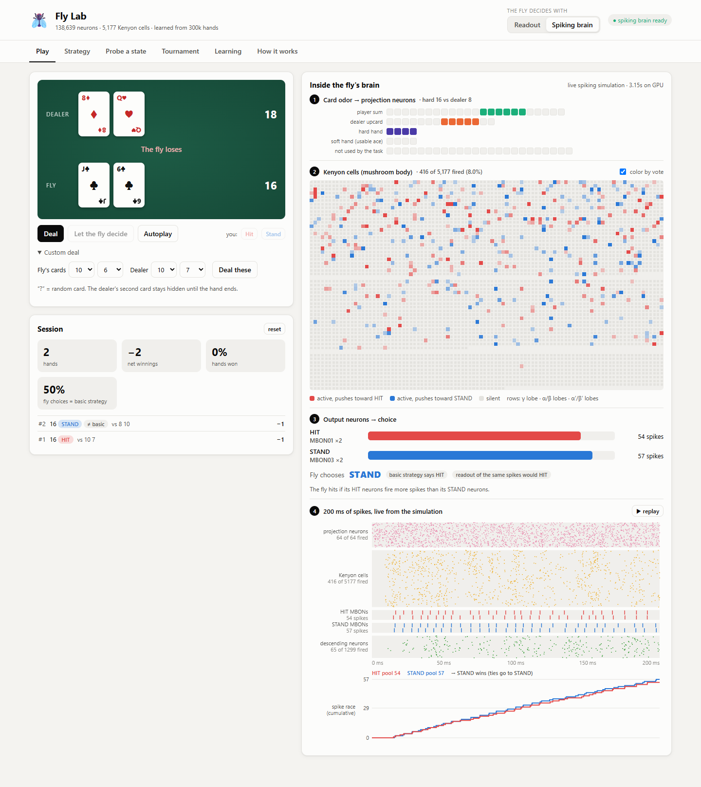
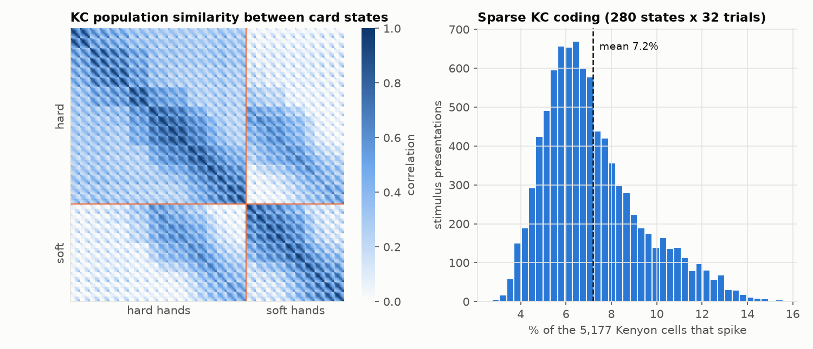
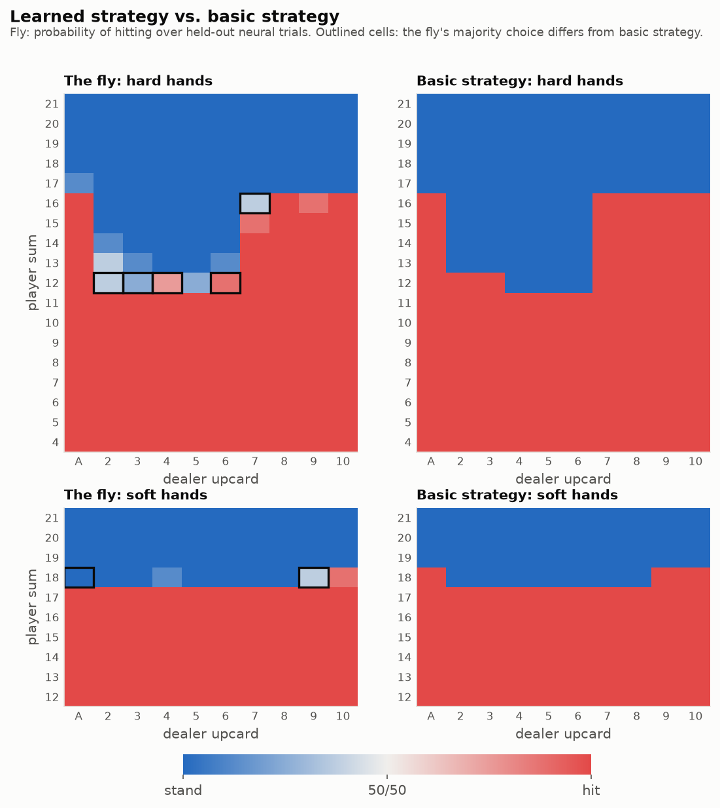
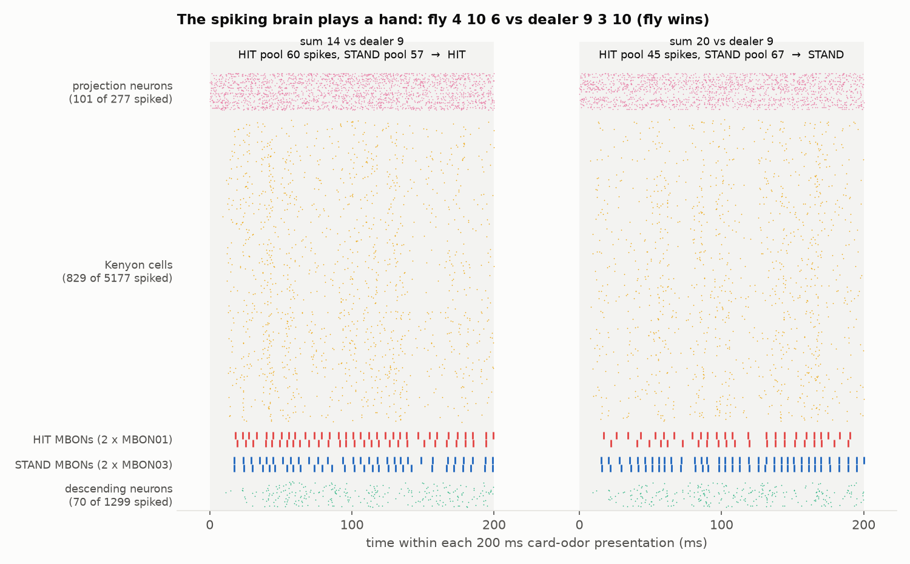

# 🪰🃏 fruitfly-blackjack

Teaching the **whole-brain connectome of the adult fruit fly** (*Drosophila melanogaster*)
to play **Blackjack**.

The brain is the leaky integrate-and-fire (LIF) emulation of the full
[FlyWire](https://flywire.ai/) v783 connectome (138,639 neurons, ~15M connections between
neuron pairs) from [eonsystemspbc/fly-brain](https://github.com/eonsystemspbc/fly-brain),
which is based on Shiu et al., *Nature* 2024. The fly learns the way real flies learn.
Cards are presented as **odors** to its olfactory projection neurons, the activity spreads
through the real wiring to the **mushroom body**, and a **dopamine-like reward signal**
reshapes the Kenyon cell → output neuron synapses. The learned synapses are then written
back into the connectome, and the spiking brain plays hands on its own.

| policy | expected reward / hand | agrees with basic strategy |
|---|---:|---:|
| random | −0.365 | – |
| always stand | −0.183 | 39.3% |
| never bust | −0.113 | 77.1% |
| dealer rule (hit below 17) | −0.079 | 87.1% |
| fly, control: readout of projection neurons (no mushroom body) | −0.061 | 91.4% |
| **fly: mushroom body** (5 seeds, held-out neural trials) | **−0.0485 ± 0.0001** | **97.5%** |
| **fly: pure spiking brain with the learned synapses** | **−0.056** | **95.1%** (per trial) |
| basic strategy (optimal) | −0.0468 | 100% |

Values are exact expectations over the infinite deck, computed by dynamic programming over
the fly's (noisy) choice probabilities. Monte Carlo cross-checks agree (tables below).



## Fly Lab: watch the fly play

```bash
python -m flyjack.web          # opens http://127.0.0.1:8000
```

A simple spectator view puts the fly and the blackjack table first. Click **Watch the
fly play** for continuous play, or **One hand** to watch a single game. Cards appear in
sequence, the fly announces its hit or stand choice, and the dealer reveals its hand.
Pause and resume at any point, change the pace, or choose **Finish hand** to stop after
the current game. Playback also pauses when you leave the browser tab.

The default uses learned responses to recorded brain activity. **Playback settings**
also offers live spiking-brain decisions on a CUDA GPU. The animated fly and progress
steps illustrate the decision sequence; they are not a neural-activity measurement.



The **Explore the lab** link opens the original research interface at `/lab.html`,
with its detailed neural visualizations and experiments:

- **Play:** deal random or hand-picked cards and let the fly decide. Each decision shows the
  card odor on the projection neurons, which Kenyon cells fired and which way each one votes,
  the HIT/STAND output pools, and whether basic strategy agrees. In **Spiking brain** mode
  (CUDA GPU; the brain loads once in ~20 s, then each decision takes a few seconds) every
  decision is a live 200 ms whole-brain simulation, replayed as an animated spike raster with
  the "race" between the HIT and STAND neurons.
- **Strategy:** the fly's choice probabilities in all 280 states next to basic strategy
  (readout or closed-loop spiking brain). Hover for predicted vs. true values, click to probe.
- **Probe a state:** present one situation many times and see how reliable the choice is.
- **Tournament:** the fly against the reference strategies on up to 200k hands.
- **Learning:** training curves, plus **train a new fly** from scratch and watch it learn live.
  It can then play in every tab. Saved results are never overwritten.



## How it works

### 1. Cards as odors
An observation is *(player sum 4–21, dealer upcard A–10, usable ace)*, which gives 280 decision
states. The 69 uniglomerular projection-neuron (PN) types, one per antennal-lobe glomerulus,
serve as sensory channels. A seeded shuffle splits them into three pools. Each feature value
activates a sliding window of channels (6 for the sum, 5 for the dealer card, 4 for the ace
flag), so neighbouring sums "smell" alike. Every PN of an active channel gets 150 Hz Poisson
input for 200 ms (`flyjack/encoding.py`).

### 2. The frozen brain responds
The whole connectome is simulated with the upstream model's parameters and update order
(`flyjack/brain.py`). The simulator is event-driven: only the synapses of neurons that
spiked are touched, and a ring buffer handles the 1.8 ms delay. It runs batched on CPU or
CUDA, at about 0.2 s of wall time per simulated trial-second on an RTX 5060 Ti at batch
size 280. Every state was presented in 32 independent Poisson trials, and the spike counts
of PNs, Kenyon cells (KCs), MBONs, DANs, APL and descending neurons are cached in
`data/cache/responses.npz` (7 MB, included).

**A finding worth knowing.** Driving PNs naively ignites the whole antennal lobe within
~20 ms: lateral excitation recruits every PN, and even ORNs are back-driven. The result is
55–72% of all KCs firing for *every* odor (pairwise correlation 0.9–0.99). Removing KC→KC
synapses alone does not fix this. The fix is a **PN clamp**, like an optogenetic experiment:
all synapses *onto* antennal-lobe PNs are removed, so the odor alone sets PN firing.
KC coding then becomes sparse and odor-specific, as in real flies:

- **7.2%** of the 5,177 KCs spike per presentation (2.3 spikes per active KC)
- same state across trials: correlation 0.85; neighbouring sums 0.82; distant sums 0.39;
  hard vs. soft hand with the same sum 0.74



### 3. Dopamine teaches the mushroom body
Two output pools, HIT and STAND, read the (L2-normalised) KC vector through plastic weights
(`flyjack/mushroom_body.py`). After each action a dopamine-like prediction error
`δ = r + max_a' MBON_a'(s') − MBON_a(s)` updates only the chosen pool's synapses from
active KCs: `Δw = η·δ·KC`. This is the fly's three-factor rule (presynaptic KC activity ×
postsynaptic MBON × dopamine), and mathematically it is Q-learning with a linear readout of
connectome-generated features. Rewards are +1 for a win, −1 for a loss and 0 for a push.
Every decision draws one of 24 recorded training trials, so the fly never sees the same
neural pattern twice. Evaluation uses the 8 held-out trials. Training takes 300k hands and
about 10 s per seed (`flyjack/train.py`).

The learned strategy matches textbook basic strategy almost everywhere. The few
disagreements sit on basic strategy's closest calls: hard 12 vs. 2–6, 16 vs. 7, and soft 18.



**The KC expansion matters.** The same rule and budget applied directly to the projection
neurons (the input to the mushroom body) reaches only −0.061 and 91% agreement. PN coding is
nearly additive in the card features. The random PN→KC wiring mixes them non-linearly,
which lets a linear readout represent interactions such as "16 is a hit against 7 but a
stand against 6".

### 4. The fly plays for real (closed loop)
`flyjack/closed_loop.py` writes the learned readout into the connectome as excitatory
synapses from every KC onto two pairs of real MBONs, which replace their native KC inputs:

- **HIT pool:** MBON01 (MBON-γ5β′2a, left and right)
- **STAND pool:** MBON03 (MBON-β′2mp, left and right)

Both types are silent during the task and get ~85% of their input from KCs. KCs are
cholinergic, so every weight is positive. The per-KC preference `w_hit − w_stand` is split
push-pull, with its positive part onto HIT and its negative part onto STAND, over a
baseline weight. The readout's bias is folded into a uniform per-KC term. MBON03 receives
more native excitation than MBON01, so the HIT baseline is set **homeostatically**: before
learning, both pools fire equally on average. At gain 200 the installed connections carry
a median of 6.5 and a 99th percentile of 56 synapses.

Hands are then played **only with the spiking simulation**. The card odor drives PNs for
200 ms, and the fly hits if the HIT MBONs fire more spikes than the STAND MBONs.

| closed-loop metric | value |
|---|---:|
| spiking decision = mushroom-body readout (same trial) | 95.5% (8 trials × 280 states) |
| spiking decision = basic strategy | 95.1% per trial, 97.9% majority vote |
| exact expected reward of the spiking policy | −0.0557 |
| 4,000 hands played live in the spiking brain | −0.043 ± 0.030 (95% CI) |

The spiking brain loses about 0.007 per hand relative to the readout. Most of the gap is
decisions near the readout's boundary, where the spike-count comparison is noisy (2.7% of
trials are exact ties, resolved as STAND). GPU runs are not bit-reproducible (CUDA atomic
adds), so repeated closed-loop runs differ slightly (another run: 96.1% agreement, −0.051).



### Honest caveats
- Learning happens in the readout model (`mushroom_body.py`) on recorded KC responses, not
  through online plasticity inside the spiking simulation. The spiking brain then uses the
  learned weights as fixed synapses. The KC representation, the spiking dynamics and the
  decision in the closed loop all come from the connectome model.
- Readout weights are signed. Real dopaminergic plasticity mostly depresses KC→MBON
  synapses; the closed loop keeps every synapse excitatory by using the push-pull pool pair.
- The PN clamp removes feedback onto PNs. This is a deliberate experimental manipulation;
  without it the point-neuron model's antennal lobe has no odor specificity.
- The two MBON types were chosen for being silent, KC-dominated and bilateral, not because
  they are known to control Blackjack-like choices (γ5β′2a output is normally linked to
  avoidance). The homeostatic baseline is a single calibrated scalar.
- Game rules: infinite deck, hit/stand only (no double, split or surrender), dealer peeks
  and stands on all 17s, a natural pays 1:1. Basic strategy is the exact optimum under
  these rules.

## Reproduce

```bash
python -m venv .venv && . .venv/bin/activate        # Windows: .venv\Scripts\activate
pip install torch --index-url https://download.pytorch.org/whl/cu128   # or the CPU build
pip install -r requirements.txt && pip install -e .
python scripts/download_data.py          # connectome + FlyWire annotations -> data/raw/
pytest -q

python -m flyjack.record --trials 32 --device cuda   # ~8 min on GPU (optional: cached npz included)
python -m flyjack.train                              # 5 seeds x 300k hands, ~1 min
python -m flyjack.evaluate                           # table + PN control
python -m flyjack.closed_loop                        # spiking play, ~15 min on GPU
python -m flyjack.plots                              # figures/

python -m flyjack.web            # Fly Lab web interface
python play.py                   # watch the fly play in the terminal (readout on recorded trials)
python play.py --spiking         # ... or decided live by the spiking brain
```

```
hand 1: fly 10 5  |  dealer shows 10
  sum 15       HIT MBONs  63 spikes | STAND MBONs  58  ->  HIT
  draws 10 -> 10 5 10
  dealer: 10 6  =>  loss   (running total -1)
```

## Layout
| file | purpose |
|---|---|
| `flyjack/blackjack.py` | environment and exact DP (action values, expected return of any stochastic policy) |
| `flyjack/strategies.py` | baselines and basic strategy |
| `flyjack/anatomy.py` | FlyWire annotations → neuron populations |
| `flyjack/brain.py` | event-driven batched LIF whole-brain simulator (CPU/CUDA), PN-clamped task brain |
| `flyjack/encoding.py` | card states → PN odor code |
| `flyjack/record.py` | simulate all states × trials, cache responses |
| `flyjack/mushroom_body.py`, `flyjack/train.py` | KC→MBON readout and dopamine TD learning |
| `flyjack/evaluate.py`, `flyjack/plots.py` | evaluation and figures |
| `flyjack/closed_loop.py`, `play.py` | learned synapses in the connectome; spiking play |
| `flyjack/web/` | Fly Lab: local web interface (stdlib HTTP server + vanilla JS) |

## Credits
- Connectome: FlyWire, Dorkenwald et al. and Schlegel et al., *Nature* 2024 (v783).
- Whole-brain LIF model: Shiu et al., "A Drosophila computational brain model reveals
  sensorimotor processing", *Nature* 2024.
- Simulator code adapted from [eonsystemspbc/fly-brain](https://github.com/eonsystemspbc/fly-brain).
- MBON nomenclature: Aso et al., *eLife* 2014.

## License
GPL-2.0 (the simulator code is adapted from the GPL-2.0 `fly-brain` repository).
